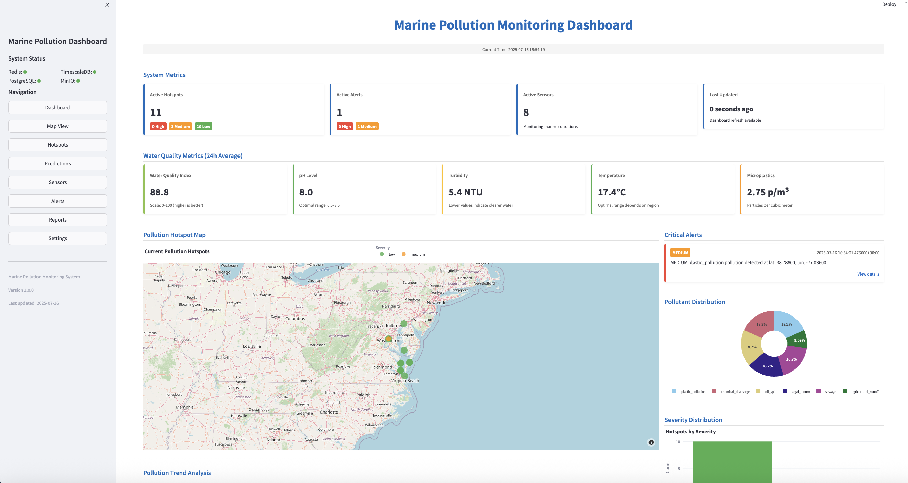
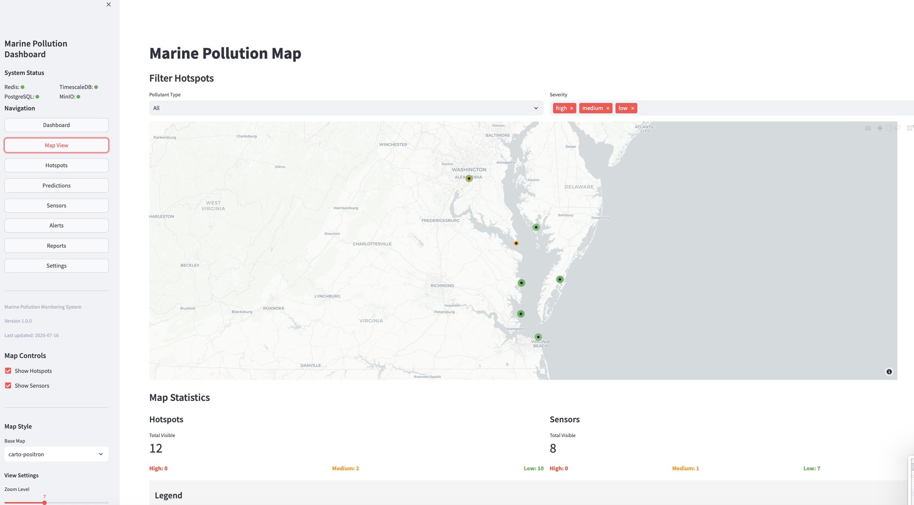
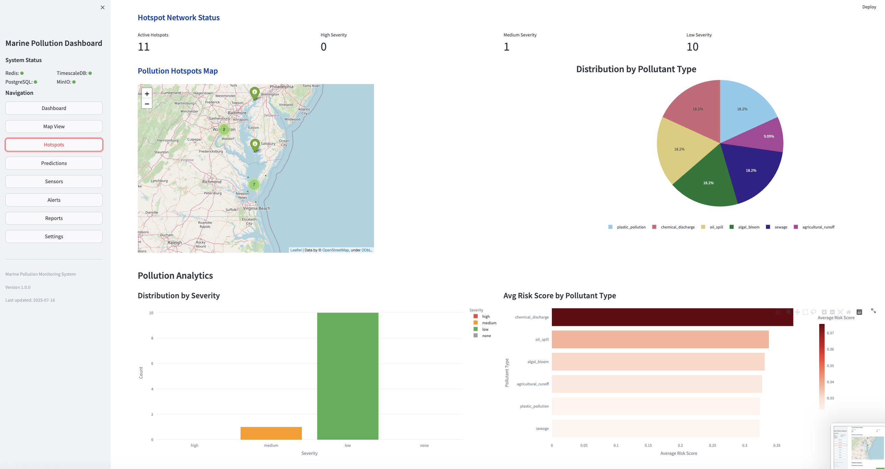
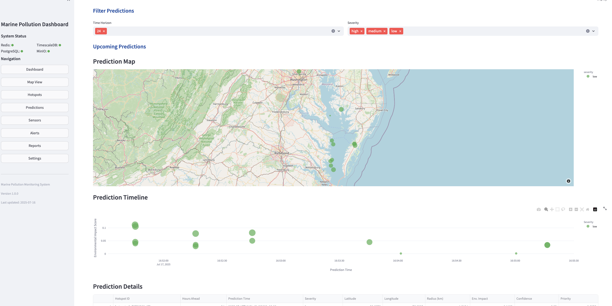
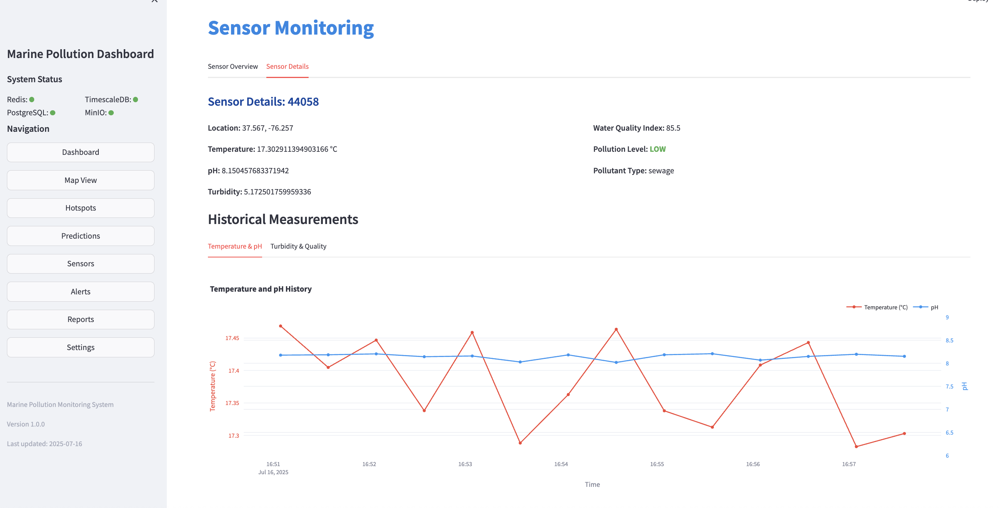
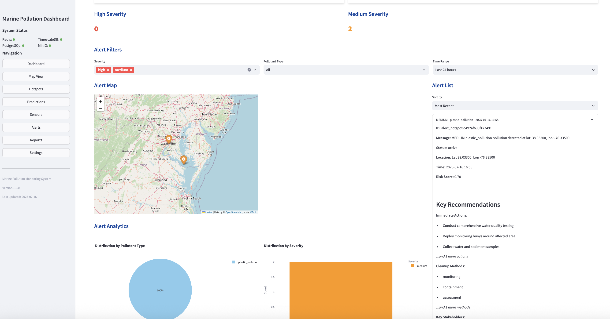
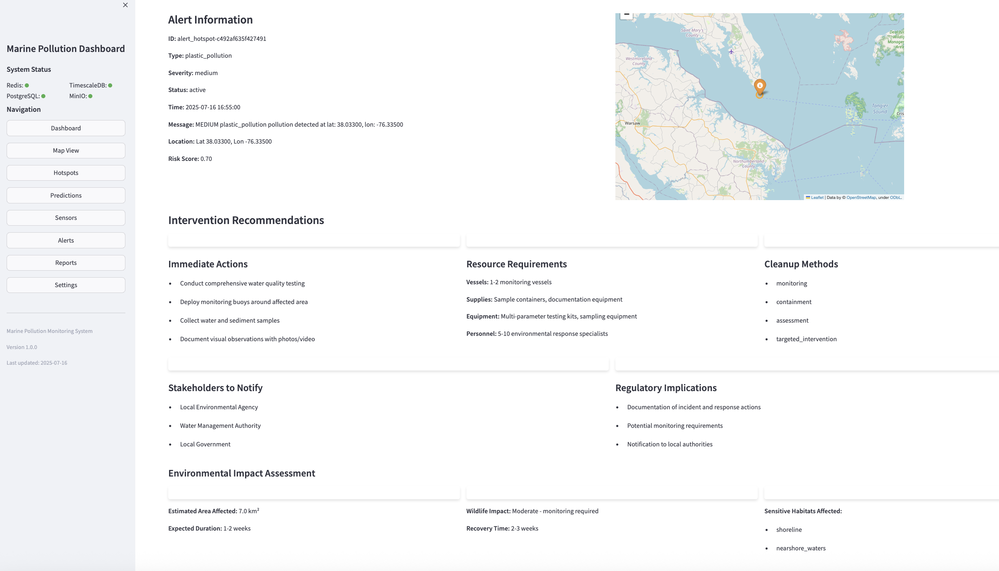
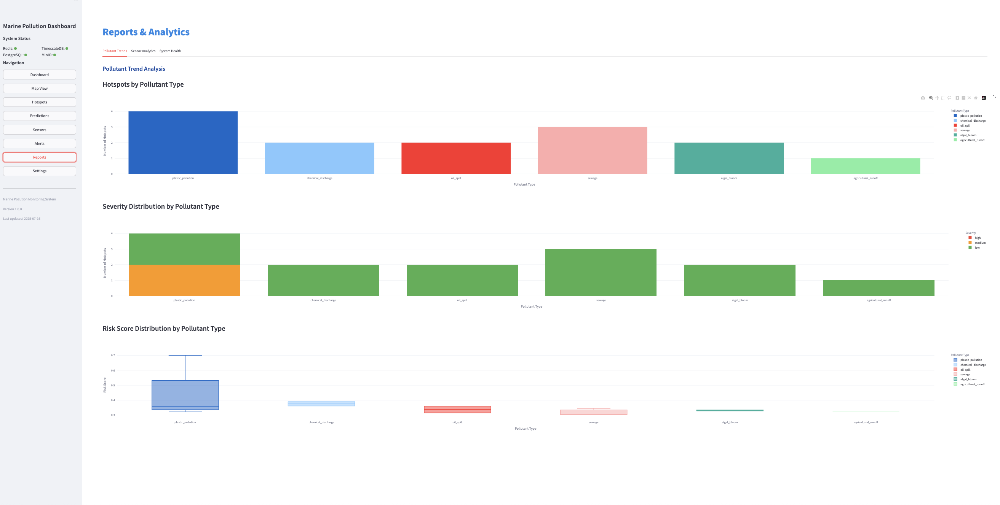

# Marine Pollution Monitoring System

An end-to-end, real-time environmental intelligence platform designed to track, analyze, and forecast marine pollution events. This system ingests satellite imagery and buoy sensor data from multiple sources, processes it using Flink-based streaming pipelines, and provides a responsive dashboard for environmental agencies to act quickly and effectively. Deployed via Docker, it integrates ML prediction models and geospatial visualizations to detect pollution hotspots, forecast their evolution, and generate automated alerts.


---

## Table of Contents

- [Marine Pollution Monitoring System](#marine-pollution-monitoring-system)
- [Project Title & Abstract](#project-title--abstract)
- [Table of Contents](#table-of-contents)
- [System Overview](#system-overview)
- [Architecture Diagram](#architecture-diagram)
- [Key Features](#key-features)
- [Dashboard Preview](#dashboard-preview)
- [Installation & Quickstart](#installation--quickstart)
- [Modules Breakdown](#modules-breakdown)
- [Performance & Monitoring](#performance--monitoring)
- [Limitations](#limitations)
- [Future Improvements](#future-improvements)
- [References](#references)
- [Team](#team)

---

## System Overview

The **Marine Pollution Monitoring System** is a real-time, distributed big data platform designed to monitor pollution in oceans, rivers, and coastal areas — with a focus on the **Chesapeake Bay**. It integrates heterogeneous data from:

- **IoT buoy sensors** (pH, turbidity, dissolved oxygen, microplastics, chemical contaminants)
- **Sentinel-2 satellite imagery**
- **Synthetic simulations** for pollution drift and environmental forecasting

Using **Apache Flink** and **Apache Kafka**, the system processes the data in streaming, extracts insights, and triggers alerts. A **Streamlit-based dashboard** allows stakeholders to track events as they happen and access predictive analytics powered by ML models grounded in fluid dynamics and seasonal patterns.

**Key objectives:**

- Unify real-time monitoring across sensor and satellite data
- Detect pollution hotspots and track contaminant evolution
- Forecast drift patterns using predictive models
- Enable environmental agencies to take immediate, data-driven action

---

## Architecture Diagram

The system follows a **microservice-oriented architecture** structured into multiple layers following the medallion data model (bronze/silver/gold):

### 🛰️ Producers
- `buoy_producer/`: emits synthetic buoy sensor data to Kafka (`buoy_data`)
- `satellite_producer/`: downloads Sentinel-2 imagery and sends raw images to Kafka (`satellite_imagery`), stores to MinIO (bronze layer)

### ⚙️ Processing Pipelines (Apache Flink)
- `sensor_analyzer/`: cleans and analyzes buoy sensor readings
- `image_standardizer/`: transforms and normalizes satellite imagery
- `pollution_detector/`: fuses image/sensor data to identify hotspots
- `ml_prediction/`: predicts pollution drift using trained models

### 🧠 Storage
- **MinIO**: object storage, medallion layers for image processing
- **PostgreSQL**: stores pollution metadata, alert history
- **TimescaleDB**: stores time-series sensor measurements

### 👁️ Consumers
- `storage_consumer/`: writes structured data into databases and MinIO
- `dashboard_consumer/`: pushes real-time metrics to Redis
- `alert_manager/`: detects high-risk events and triggers custom alerts

### 📊 Visualization
- `dashboard/`: Streamlit dashboard for live insights, maps, and alerts


---

## Key Features

This system provides a full-stack, real-time architecture with advanced environmental monitoring capabilities:

### ✅ Real-Time Multi-Source Ingestion
- Kafka-based ingestion of synthetic **buoy sensor** data (pH, turbidity, oxygen, microplastics, chemical signals)
- Scheduled fetching of **Sentinel-2 satellite imagery** using Copernicus APIs

### ⚙️ Flink Streaming Pipelines
- **Event-time processing** with exactly-once semantics for reliable pollution tracking
- **Sensor and image fusion** to detect patterns invisible to either source alone
- Pre-processing includes deduplication, spatial partitioning, and windowed aggregation

### 🔁 Medallion Architecture
- **Bronze**: raw satellite imagery (stored in MinIO)
- **Silver**: standardized and processed data
- **Gold**: analyzed pollution data and predictions

### 🧠 Machine Learning Integration
- 4 predictive models based on fluid dynamics and seasonal features
- Pollution spread prediction using spatial grid + regression models
- Real-time classification of anomaly severity

### 🚨 Alert Management
- Automatic generation of **tiered alerts** (low/medium/high) based on pollutant severity
- Configurable **email/webhook/SMS** logic via environment variables
- DLQ (Dead Letter Queues) implemented for all Kafka topics to ensure fault tolerance

### 📈 Time-Series Storage
- TimescaleDB for fast retrieval and trend analysis of sensor data
- PostgreSQL + PostGIS for geo-tagged hotspot metadata

### 🌍 Interactive Dashboard
- Built with **Streamlit**, featuring:
  - Multi-page navigation
  - Geospatial overlays for satellite + sensor layers
  - Real-time Redis-based metrics
  - Pollution forecasts and risk alerts

---

---

## Dashboard Preview

The Streamlit-based dashboard is composed of multiple pages, each providing a different view of the system’s environmental intelligence capabilities. Below is a visual and functional overview of each page.

---

### 🏠 Home

This is the main landing page of the system. It provides a comprehensive summary of the monitoring network status, active pollution hotspots, recent alerts, and average water quality metrics over the past 24 hours. Key indicators include:

- Number of active sensors, hotspots, and alerts
- pH, turbidity, microplastics, water temperature
- Pollution hotspot map
- Severity and pollutant type distribution



---

### 🗺️ Map View

This page offers a geographic view of all pollution hotspots and sensor locations with dynamic filtering by pollutant type and severity level. The map is interactive and supports detailed spatial navigation.

- Filter by pollutant/severity
- Live update of visible markers
- Summary of visible sensors and hotspots



---

### 🔥 Hotspots

The Hotspots page is dedicated to visualizing and analyzing the current pollution zones. It shows:

- Live map of pollution hotspots
- Analytics on hotspot severity
- Pie chart of pollutant type distribution
- Bar chart of average risk score by pollutant type



---

### 🔮 Predictions

This page forecasts the future location, severity, and environmental impact of pollution hotspots. The core components include:

- Prediction map (next 24h)
- Environmental impact timeline
- List of upcoming predictions by severity and coordinates



---

### 📡 Sensors

This page shows the latest sensor readings and historical trends for each monitoring device. When selecting a sensor, users see:

- Location, pH, temperature, turbidity, pollution level
- Time-series charts for water parameters
- Pollution type detected at that sensor



---

### 🚨 Alerts

The Alerts page highlights detected pollution events classified by severity. It displays:

- Count of active alerts (high, medium)
- Interactive map of alert locations
- Filters by severity, time range, and pollutant type
- Analytics: distribution of alert types and severities
- Real-time alert list with ID, status, coordinates, and risk score



---

### 🧭 Alert Details

Clicking on a specific alert brings up a detailed breakdown with intervention instructions. The alert details page provides:

- Geo-localized map of the alert location
- Recommended actions for mitigation
- Resource requirements (vessels, personnel, equipment)
- Environmental impact analysis
- Regulatory and stakeholder implications



---

### 📊 Reports

The Reports page summarizes system-wide analytics across time, offering insight into environmental trends. It includes:

- Hotspot counts by pollutant type
- Severity breakdowns
- Risk score distributions across pollutants

This page is key for regulatory reporting and long-term planning.



---

## Installation & Quickstart

Follow these steps to launch the full Marine Pollution Monitoring System locally via Docker:

### 1. Clone the repository

```bash
git clone https://github.com/andrea00mauro00/marine-pollution-tracking.git
cd marine-pollution-tracking
````

### 2. Add Sentinel Hub credentials

Create the file:

```
satellite_producer/credentials.json
```

With the following structure:

```json
{
  "client_id": "<your-client-id>",
  "client_secret": "<your-client-secret>"
}
```

You may also use the development credentials already pre-configured in `docker-compose.yml` for local testing purposes.

### 3. Start the system

```bash
docker-compose up -d
```

This command will start all services including producers, processors, databases, object storage, the alerting engine, and the visualization dashboard.

### 4. Access the system

* **Streamlit Dashboard**: [http://localhost:8501](http://localhost:8501)
* **MinIO UI (Object Storage)**: [http://localhost:9001](http://localhost:9001)

  * Username: `minioadmin`
  * Password: `minioadmin`
* **Schema Registry UI**: [http://localhost:8000](http://localhost:8000)
* **PostgreSQL DB**: accessible via port `5432`
* **TimescaleDB**: accessible via port `5433`

All services run inside containers and are networked via the internal Docker bridge `marine_net`.

---

## Modules Breakdown

The system is composed of independent microservices and Flink streaming jobs, each responsible for a specific step in the pipeline. Here’s a breakdown of all components:

### 🛰️ Producers

* **`buoy_producer/`**
  Simulates real-time sensor readings (pH, turbidity, temperature, microplastics) and publishes them to Kafka.

  * Kafka Topic: `buoy_data`

* **`satellite_producer/`**
  Periodically downloads Sentinel-2 imagery via Copernicus API and uploads them to MinIO (Bronze layer).

  * Kafka Topic: `satellite_imagery`
  * Object Storage: MinIO bucket `bronze`

---

### ⚙️ Flink Stream Processors

* **`sensor_analyzer/`**
  Parses and enriches sensor data, performs anomaly detection.

  * Input: `buoy_data`
  * Output: `analyzed_sensor_data`

* **`image_standardizer/`**
  Preprocesses satellite images (resizing, format conversion, metadata cleanup).

  * Input: `satellite_imagery`
  * Output: `processed_imagery`

* **`pollution_detector/`**
  Fuses satellite and sensor data to detect active pollution events.

  * Inputs: `analyzed_sensor_data`, `processed_imagery`
  * Outputs: `analyzed_data`, `pollution_hotspots`, `sensor_alerts`

* **`ml_prediction/`**
  Uses trained ML models to forecast pollution spread and environmental impact.

  * Inputs: `analyzed_sensor_data`, `processed_imagery`
  * Output: `pollution_predictions`

---

### 💾 Storage & Data Lake

* **MinIO**
  Serves as the object storage backend for raw and processed satellite images using a medallion architecture:

  * `bronze`: raw images
  * `silver`: standardized images
  * `gold`: pollution masks and prediction overlays

* **PostgreSQL**
  Stores structured metadata about pollution events, alert records, and user feedback.

* **TimescaleDB**
  Optimized for storing high-frequency sensor measurements over time. Enables efficient queries, downsampling, and trend analysis.

---

### 📥 Consumers & Persistence

* **`storage_consumer/`**
  Consumes all processed topics and stores them into PostgreSQL, TimescaleDB, and MinIO accordingly.

* **`dashboard_consumer/`**
  Subscribes to all Kafka topics and pushes real-time updates to Redis for live dashboard rendering.

---

### 🚨 Alerting

* **`alert_manager/`**
  Detects high-risk events and emits tiered alerts (low/medium/high). Can be configured to:

  * Send email, SMS, webhook notifications
  * Route alerts to different recipients based on location
  * Track alert history and resolution status

---

### ❌ Error Handling

* **`dlq_consumer/` + `create_dlq_topics.py`**
  Implements Dead Letter Queues (DLQs) for every Kafka topic to prevent data loss in case of serialization or processing errors.

---

### 📊 Dashboard

* **`dashboard/`**
  Built with Streamlit, this frontend aggregates all data layers into a single live monitoring interface. It provides:

  * Navigation through multiple views (overview, map, predictions, reports)
  * Real-time maps and trend visualizations
  * Integration with Redis, TimescaleDB, PostgreSQL, and MinIO

All components are designed to be stateless and restartable. The system is fully containerized, making it portable, reproducible, and scalable.

---

## Limitations

While the prototype successfully demonstrates the core features of a real-time marine pollution monitoring system, several technical and architectural limitations remain:

### ⚠️ Data Source Limitations
- All data used in this implementation is **synthetic** (sensor and satellite), not real NOAA/USGS or Copernicus feeds.
- No real-world validation of the alerting and prediction accuracy.

### 📉 Machine Learning Shortcomings
- Static ML models (Random Forests) trained on synthetic datasets.
- No continuous learning, versioning, or performance monitoring pipeline implemented.
- Absence of drift detection and retraining mechanisms.

### 📦 System Architecture Constraints
- Kafka is deployed in **single-broker** mode without replication or partitioning — not suitable for production scale.
- **Fixed spatial grid** for hotspot detection may miss pollution clusters near boundaries or in highly variable density regions.
- TimescaleDB lacks automated retention policies and advanced downsampling strategies.
- Dashboard analytics are limited (e.g., no export, filtering, or user annotation features).

### 🧠 Observability & Ops
- No real-time system monitoring (e.g., Prometheus, Grafana, ELK).
- Minimal observability: only structured logging and Redis pub/sub used.

---

## Future Improvements

With additional time and resources, the following upgrades would make the system production-ready and more robust:

### ✅ Data & ML Enhancements
- Integrate **real data sources** from NOAA, USGS, and Sentinel Hub (Copernicus APIs)
- Build a **retraining pipeline** using incoming data streams
- Implement **drift detection** and **model performance monitoring**
- Use modern architectures like LSTM, GRU, or Transformer-based time series models

### ⚙️ Infrastructure
- Deploy **Kafka clusters** with topic replication and custom partitioning
- Add **Kubernetes orchestration** for dynamic autoscaling and zero-downtime rollouts
- Move toward **cloud-native storage** with governance tools (e.g., AWS S3 + Lake Formation)

### 📊 Dashboard Extensions
- Add data export (CSV, GeoJSON), time filters, user feedback input
- Integrate multi-layer overlays (e.g., temperature, salinity, wind)
- Add download/export functionality for analytics and reports

### 📌 Geo & Spatial Improvements
- Use **adaptive spatial clustering** based on pollution density
- Handle **boundary-overlapping events** and mobility of hotspots
- Implement **spatiotemporal joins** between satellite events and sensor anomalies

---

## References

This project leverages foundational research in environmental monitoring, anomaly detection, and satellite image analysis:

[1] Sannigrahi, S., Basu, B., Basu, A. S., & Pilla, F. (2021). *Detection of marine floating plastic using Sentinel-2 imagery and machine learning models*. arXiv preprint arXiv:2106.03694.

[2] Walsh, E. S., Kreakie, B. J., Cantwell, M. G., & Nacci, D. (2017). *A Random Forest approach to predict the spatial distribution of sediment pollution in an estuarine system*. PLoS One, 12(7), e0179473.

[3] Li, Z., Zhu, Y., & Van Leeuwen, M. (2023). *A survey on explainable anomaly detection*. ACM Transactions on Knowledge Discovery from Data, 18(1), 1–54.

[4] El-Shafeiy, E., Alsabaan, M., Ibrahem, M. I., & Elwahsh, H. (2023). *Real-time anomaly detection for water quality sensor monitoring based on multivariate deep learning technique*. Sensors, 23(20), 8613.

[5] Zhou, H., Zhang, S., Peng, J., Zhang, S., Li, J., Xiong, H., & Zhang, W. (2021). *Informer: Beyond efficient transformer for long sequence time-series forecasting*. Proceedings of the AAAI Conference on Artificial Intelligence, 35(12), 11106–11115.

[6] Yao, J., Zhang, B., Li, C., Hong, D., & Chanussot, J. (2023). *Extended Vision Transformer (ExViT) for Land Use and Land Cover Classification: A Multimodal Deep Learning Framework*. IEEE Transactions on Geoscience and Remote Sensing, 61, 1–15. https://doi.org/10.1109/TGRS.2023.3284671

[7] Sadaiappan, B., Balakrishnan, P., CR, V., Vijayan, N. T., Subramanian, M., & Gauns, M. U. (2023). *Applications of machine learning in chemical and biological oceanography*. ACS Omega, 8(18), 15831–15853.

---

## Team

This project was developed by:

- [@lorenzoattolico](https://github.com/lorenzoattolico)  
- [@00andrea00mauro](https://github.com/00andrea00mauro)  
- [@marcoRossi27](https://github.com/marcoRossi27)  
- [@walterscf](https://github.com/walterscf)


