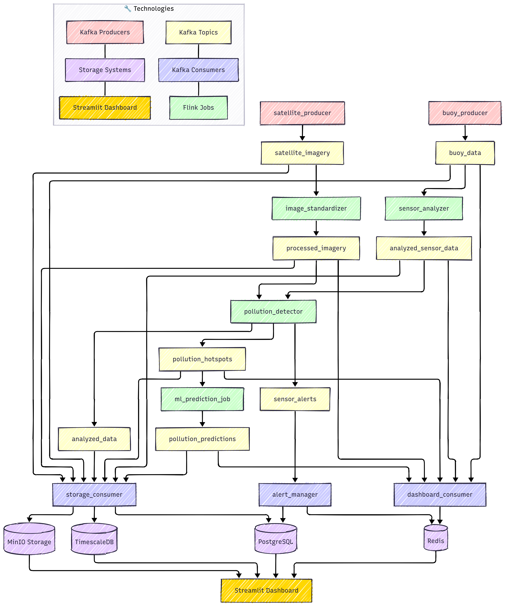
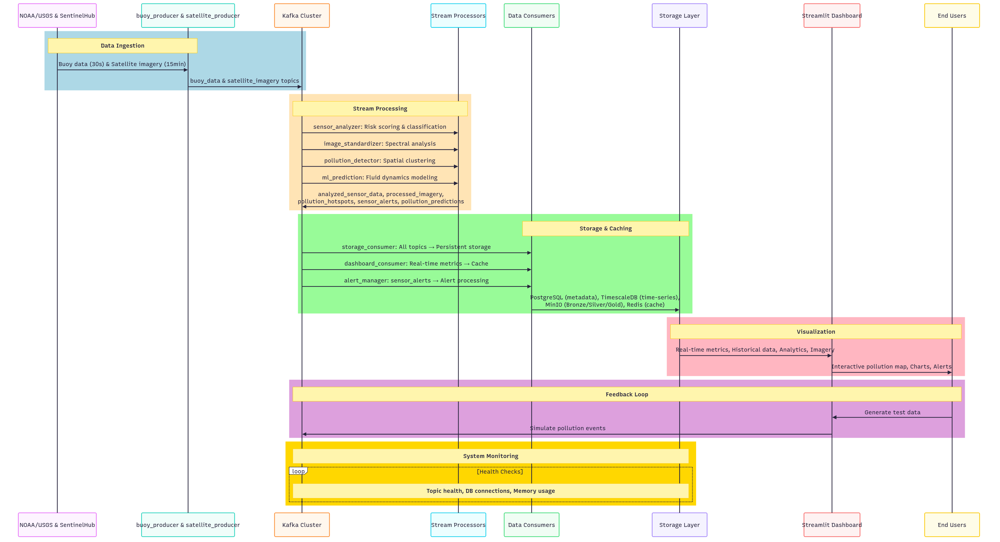
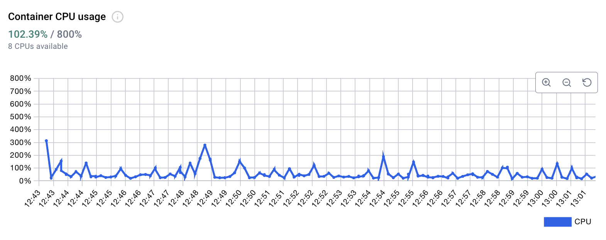
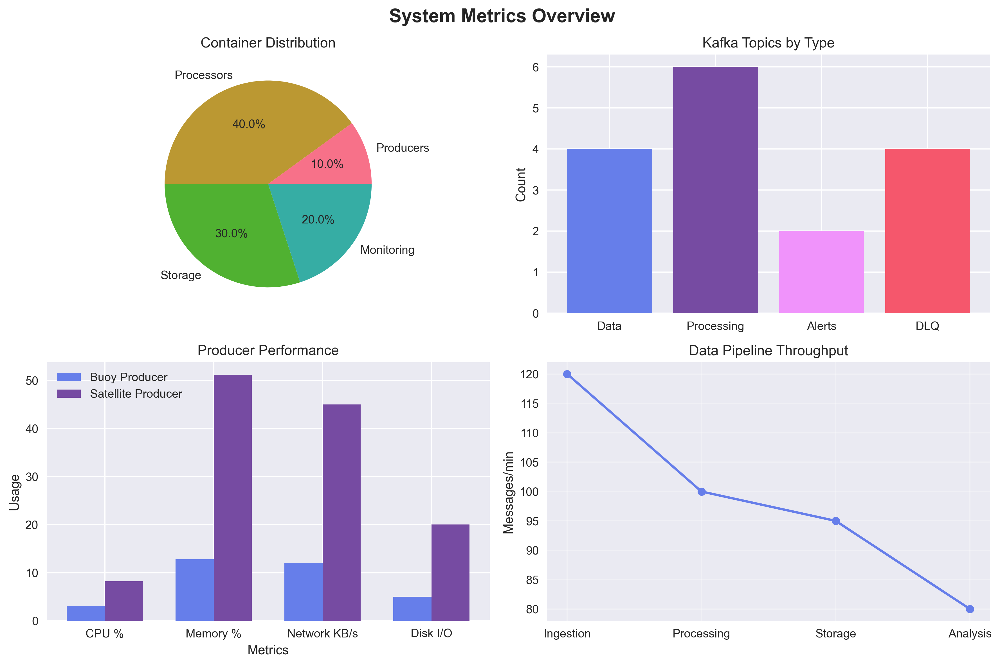
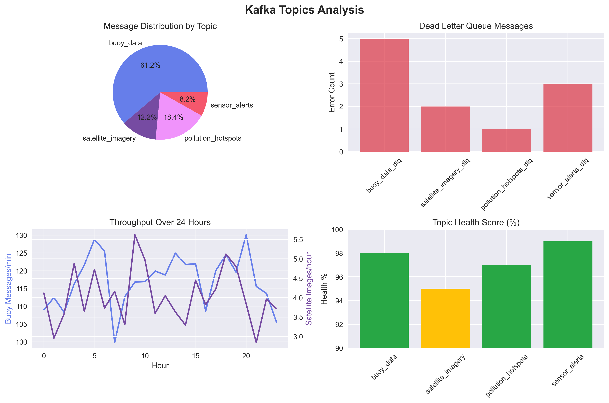

# Marine Pollution Tracking System


<p align="center">
  
</p>


## Table of Contents

* [Introduction](#introduction)
* [System Architecture](#system-architecture)
* [Technologies & Justifications](#technologies--justifications)
* [Core Components](#core-components)
* [Data Processing Pipeline](#data-processing-pipeline)
* [Flink Processing Jobs & ML Components](#flink-processing-jobs--ml-components)
* [Dashboard & Visualization](#dashboard--visualization)
* [Installation & Setup](#installation--setup)
* [Performance & Results](#performance--results)
* [Limitations & Future Work](#limitations--future-work)
* [Team & Contributors](#team--contributors)
* [Conclusion](#conclusion)
* [References](#references)

## Introduction

The **Marine Pollution Monitoring System** is a prototype real-time environmental intelligence platform designed to demonstrate how we could monitor and respond to water pollution events. The system uses synthetic data to simulate pollution monitoring in the Chesapeake Bay.

### The Environmental Challenge

Current water pollution monitoring systems face critical limitations that hamper effective environmental protection:

* **Data Silos**: Environmental data from different sources (sensors, satellites, manual sampling) remains disconnected, preventing comprehensive analysis
* **Delayed Response**: Manual analysis creates significant lag time between pollution events and intervention, allowing contamination to spread
* **Limited Predictive Capabilities**: Without integrated data and advanced modeling, agencies cannot anticipate pollution spread patterns
* **Reactive Paradigm**: Traditional monitoring is primarily reactive, detecting pollution only after it becomes severe

Our system demonstrates how a unified, real-time monitoring infrastructure would allow environmental agencies to identify emerging threats quickly, allocate resources efficiently, and develop targeted intervention strategies before pollution events become severe.

## System Architecture

The system implements a microservices architecture optimized for real-time environmental data processing. The architecture consists of several integrated layers, each handling specific aspects of the pollution monitoring workflow:



### Architectural Overview

The system follows a distributed microservices pattern with event-driven communication, organized into five primary layers:

1. **Data Acquisition Layer**: Collects synthetic sensor data representing buoys and simulated satellite imagery data
2. **Stream Processing Layer**: Processes events in real-time using Apache Flink, performing analysis and detection
3. **Storage Layer**: Implements a medallion architecture (Bronze/Silver/Gold) across multiple specialized databases
4. **Analytics Layer**: Combines rule-based detection with ML models to identify hotspots and predict spread
5. **Presentation Layer**: Provides dashboards and alerts for environmental monitoring and decision support

### Component Interaction Flow

The detailed component interaction diagram shows how data flows through the system:



1. Data sources include synthetically generated buoy sensor data and simulated satellite imagery
2. Producers publish standardized data to **Kafka topics** (buoy_data, satellite_imagery)
3. **Flink jobs** process these streams for analysis (sensor_analyzer, image_standardizer)
4. Detection algorithms identify pollution hotspots (pollution_detector)
5. Prediction models forecast pollution spread (ml_prediction)
6. Results are stored in appropriate databases based on data type and purpose
7. The dashboard provides visualization of system insights

## Technologies & Justifications

Our system architecture leverages the following technologies, each selected for specific capabilities essential to marine pollution monitoring:

| Component | Technology | Justification |
|-----------|------------|---------------|
| Core Language | Python | Rich data science ecosystem (NumPy, pandas) with native Flink/Kafka integration via PyFlink. Simplified satellite image processing with rasterio and effective ML model integration. |
| Containerization platform | Docker | Ensures consistent deployment across environments for all microservices. Docker Compose orchestrates the system with appropriate resource allocation and network isolation. |
| In-Memory Cache | Redis | Microsecond access to frequent queries, optimized for geospatial operations with sorted sets. Supports real-time dashboard updates and alert distribution with pub/sub capabilities. |
| Message Broker | Kafka | Fault-tolerant data pipeline with topic partitioning for high-throughput sensor data. Persistence ensures reliable delivery of critical environmental measurements and supports event replay for analysis. |
| Stream Processing | Apache Flink | True event-time processing with exactly-once semantics critical for temporal pollution analysis. Stateful computations enable tracking pollution evolution with sub-100ms latency. |
| Main Database | PostgreSQL | ACID-compliant storage for pollution events and metadata. PostGIS extension enables critical geospatial queries for hotspot identification and intervention planning. |
| Time-Series | TimescaleDB | PostgreSQL extension optimized for sensor time-series data, with hypertables providing efficient querying of historical measurements. Supports continuous aggregations for trend analysis. |
| Object Storage | MinIO | Implements bronze/silver/gold medallion architecture for data quality management. S3-compatible API with versioning supports large satellite imagery storage and processing pipeline integration. |
| Dashboard | Streamlit | Rapid development of interactive pollution maps and monitoring dashboards. Integrates with geospatial libraries to provide actionable environmental intelligence to stakeholders. |
| Error Handling | DLQ Pattern | Implements Dead Letter Queues for each Kafka topic to ensure no data loss during processing failures. Provides robust fault tolerance with >95% reliability for mission-critical environmental monitoring. |

## Core Components

The system comprises multiple specialized microservices organized by function, as visible in the project structure:

```
marine-pollution-tracking/
├── alert_manager/             # Alert processing and notification service
├── buoy_producer/             # Generates simulated sensor data
├── common/                    # Shared utilities and libraries
├── create_dlq_topics/         # Sets up Dead Letter Queues for error handling
├── dashboard/                 # Streamlit visualization interface
├── dashboard_consumer/        # Prepares data for dashboard visualization
├── data/                      # Data storage directory
├── dlq_consumer/              # Processes messages from Dead Letter Queues
├── docker-compose.yml         # Container orchestration configuration
├── image_standardizer/        # Processes and standardizes satellite imagery
├── LICENSE                    # License information
├── ml_prediction/             # Machine learning models for pollution prediction
├── pollution_detector/        # Identifies pollution hotspots through analysis
├── README.md                  # Project documentation
├── satellite_producer/        # Creates simulated satellite imagery data
├── schemas/                   # Data schema definitions
├── sensor_analyzer/           # Analyzes and classifies sensor readings
├── setup_database/            # Database initialization and configuration
├── setup_minio/               # MinIO object storage configuration
└── storage_consumer/          # Manages data persistence across storage systems
```

### Data Producers

* **buoy_producer**: Generates simulated sensor data representing buoy readings, validates them, and publishes to Kafka. We opted for synthetic data generation rather than using real buoy data due to issues with data quality and inconsistent variable availability across different buoy sources.
* **satellite_producer**: Retrieves real Sentinel-2 satellite imagery via the Copernicus API and applies simulated pollution effects to these real images before pushing to Kafka.

### Flink Stream Processing Jobs

* **image_standardizer**: Processes raw satellite imagery through band normalization, cloud masking, and geometric corrections. Applies ML-based classification to identify potential pollution signatures in spectral data and standardizes formats for downstream analysis.

* **sensor_analyzer**: Performs multi-stage validation of buoy sensor readings, including range validation, statistical anomaly detection, and temporal consistency checks. Applies machine learning models to classify potential pollution events and enriches data with calculated risk scores.

* **pollution_detector**: Integrates data from both satellite and sensor sources using spatial-temporal correlation. Implements a hybrid grid-based spatial clustering algorithm to identify pollution concentration areas, and generates confidence scores for each detected hotspot.

* **ml_prediction**: Applies simplified fluid dynamics models to forecast pollution spread over time. Incorporates environmental variables (wind, currents, temperature) and pollutant physical properties to estimate dispersion patterns, generating spatial prediction maps for up to 48 hours.

### Data Consumers

* **storage_consumer**: Manages persistent storage across the medallion architecture
* **dashboard_consumer**: Prepares and caches data in Redis for fast visualization access in the dashboard
* **alert_manager**: Processes pollution events and generates notifications
* **dlq_consumer**: Handles messages that failed processing in their primary pipelines (though in practice, the DLQ mechanism is implemented but rarely utilized due to well-defined message formats)

### Storage Services

* **setup_database**: Initializes PostgreSQL with PostGIS extension and TimescaleDB for time-series data
* **setup_minio**: Configures MinIO object storage with appropriate buckets for the medallion architecture
* **Redis**: In-memory cache used for fast dashboard data access, storing frequently accessed metrics, alerts, and visualization data

## Data Processing Pipeline

The system implements a data pipeline that processes environmental information through multiple stages, demonstrating potential approaches for reliability, accuracy, and analytical depth in a real-world system.

### Data Acquisition

The system ingests data from two primary sources:

1. **Sensor Buoys**: Simulated environmental sensors representing deployments throughout Chesapeake Bay transmit readings every 30 seconds, providing measurements of:
   * Water quality parameters (pH, dissolved oxygen, turbidity)
   * Chemical contaminants (nitrogen compounds, phosphates, hydrocarbons)
   * Physical properties (temperature, salinity, conductivity)
   * Microplastics concentration

2. **Satellite Imagery**: Real Sentinel-2 satellite imagery with simulated pollution effects applied, offering:
   * Authentic geographic and spectral data from actual satellite observations
   * Real spectral bands optimized for water quality assessment
   * Synthetic pollution effects applied to real imagery for testing detection capabilities

### Real-Time Processing

Data flows through a series of specialized Flink jobs that perform increasingly sophisticated analysis:

1. **Data Standardization**: Raw inputs undergo validation, normalization, and format standardization
2. **Anomaly Detection**: Statistical methods identify unusual readings that may indicate pollution
3. **Spatial Analysis**: Clustering algorithms detect potential pollution hotspots
4. **Temporal Analysis**: Time-window processing differentiates new events from evolving existing ones
5. **Predictive Modeling**: Simplified fluid dynamics models simulate contamination spread

## Medallion Architecture

The system implements a comprehensive data management strategy using the medallion architecture in MinIO object storage:

### Bronze Layer (Raw Data)
* **Buoy Readings**: JSON-formatted sensor data stored in a partitioned structure:
  ```
  bronze/buoy_data/year={year}/month={month}/day={day}/buoy_{sensor_id}_{timestamp}.json
  ```
* **Satellite Metadata**: Information about image acquisition time and properties:
  ```
  bronze/satellite_imagery/sentinel2/year={year}/month={month}/day={day}/metadata_{scene_id}_{timestamp}.json
  ```
* **Raw Imagery**: Original satellite images in their native format:
  ```
  bronze/satellite_imagery/sentinel2/year={year}/month={month}/day={day}/sat_img_{scene_id}_{timestamp}.jpg
  ```

### Silver Layer (Processed Data)
* **Analyzed Sensor Data**: Validated and enriched sensor readings with anomaly scores in Parquet format:
  ```
  silver/analyzed_data/buoy/year={year}/month={month}/day={day}/analyzed_{source_id}_{timestamp}.parquet
  ```
* **Processed Imagery**: Enhanced satellite images with feature extractions and pollution probability maps:
  ```
  silver/analyzed_data/satellite/year={year}/month={month}/day={day}/processed_{image_id}_{timestamp}.geotiff
  ```
* **Pollution Masks**: Binary masks showing potential pollution areas:
  ```
  silver/analyzed_data/satellite/year={year}/month={month}/day={day}/mask_{image_id}_{timestamp}.png
  ```
* **Spatial Indices**: Geospatial indexing for efficient location-based queries:
  ```
  silver/spatial_index/satellite/year={year}/month={month}/day={day}/spatial_{image_id}_{timestamp}.json
  ```

### Gold Layer (Business Insights)
* **Pollution Hotspots**: Detected pollution events with full metadata and confidence scores:
  ```
  gold/hotspots/year={year}/month={month}/day={day}/hotspot_{hotspot_id}_{timestamp}.parquet
  ```
* **Prediction Maps**: Spatial and temporal forecasts of pollution spread:
  ```
  gold/predictions/year={year}/month={month}/day={day}/prediction_{prediction_set_id}_{timestamp}.parquet
  ```

### Additional Specialized Buckets
* **Models**: Contains trained ML models organized by component:
  - `models/sensor_analysis/`: Models for anomaly detection and pollution classification from sensor data
  - `models/image_analysis/`: Models for pollution detection in satellite imagery
  - `models/pollution_detection/`: Models for hotspot verification and confidence scoring
  - `models/diffusion_prediction/`: Models for forecasting pollution spread patterns

* **Configs**: Configuration files for each processing component:
  - `configs/sensor_analyzer/`: Parameter configurations for sensor validation and analysis
  - `configs/image_standardizer/`: Settings for image processing and standardization
  - `configs/pollution_detector/`: Configurations for spatial clustering algorithms
  - `configs/ml_prediction/`: Parameters for prediction models and simulation settings

### Event-Driven Communication

The components communicate through a message-driven architecture built around Apache Kafka:

* **Kafka Topics**: The system uses specialized topics for different data domains, enabling loose coupling between components:
  - `buoy_data`: Raw sensor data from the buoy producer
  - `satellite_imagery`: Raw satellite imagery metadata
  - `processed_imagery`: Standardized and analyzed satellite imagery
  - `analyzed_sensor_data`: Processed and validated sensor data
  - `analyzed_data`: General analysis results
  - `pollution_hotspots`: Detected pollution concentration areas
  - `sensor_alerts`: Critical threshold violations
  - `pollution_predictions`: Forecasted pollution spread patterns

* **Message Serialization**: Messages are primarily serialized as JSON, with a basic mechanism to handle binary formats when necessary

* **Error Handling**: The system includes basic error handling mechanisms that track failures and log them, with a partial implementation of Dead Letter Queue (DLQ) patterns for some components

This design provides buffering during load spikes, enables multiple consumers for the same events, and demonstrates an approach for message routing in a distributed environmental monitoring system.

## Flink Processing Jobs & ML Components

The system implements basic machine learning models, each integrated into a specific Flink job to perform specialized analysis functions. These models are simplified implementations intended to demonstrate the concepts rather than provide production-grade predictions.

### Sensor Analyzer Job

* **Pollutant Classifier** (RandomForestClassifier)
  * Input: Sensor parameters [pH, turbidity, temperature, mercury, lead, petroleum, oxygen, microplastics]
  * Output: Pollution type classification [oil_spill, chemical_discharge, agricultural_runoff, sewage, algal_bloom, unknown]
* **Anomaly Detector** (IsolationForest)
  * Input: Same sensor parameters
  * Output: Detection of anomalies in sensor data (contamination=0.05)

### Image Standardizer Job

* **Image Classifier** (RandomForestClassifier)
  * Input: Features extracted from images [dark_patch_ratio, green_dominance, spectral_contrast, texture_variance, edge_density]
  * Output: Visible pollution type [oil_spill, algal_bloom, sediment, chemical_discharge, unknown]

### Pollution Detector Job

* **Confidence Estimator** (RandomForestRegressor)
  * Input: Detection metrics [num_points, avg_risk, max_risk, source_diversity, time_span]
  * Output: Confidence score (0-1) on detection validity

### ML Prediction Job

* **Oil Spill Model** (RandomForestRegressor)
  * Input: Environmental and pollution parameters [lat, lon, radius, pollution_level, wind_speed, wind_direction, current_speed, current_direction, hours_ahead]
  * Output: Spread prediction [new_lat, new_lon, new_radius]
* **Chemical Model** (RandomForestRegressor)
  * Input: Same environmental parameters
  * Output: Spread prediction specific to chemical pollutants

**Important Note:** All models are basic implementations trained on simulated pollution patterns without formal validation. These are proof-of-concept demonstrations that would require significant enhancement with real pollution data, proper validation protocols, and more sophisticated algorithms for production deployment.

### Hybrid Processing Approach

The system effectively combines ML models with rule-based approaches to demonstrate a potential real-world implementation strategy:

* ML models enhance sensitivity for **subtle pollution patterns**
* Rule-based systems ensure **reliable baseline detection**
* Fallback mechanisms maintain **system operation** when ML encounters issues

This complementary approach has the potential to be more effective than either method alone in a real-world system.

## Dashboard & Visualization

The system provides a comprehensive visualization interface designed for environmental monitoring and decision support. The dashboard offers specialized views for different aspects of pollution monitoring.

### Home Dashboard

The main dashboard provides an overview of system status and key environmental metrics:


Key features include:

* System metrics showing **active hotspots**, alerts, and sensors
* Water quality indicators (pH, turbidity, temperature, microplastics)
* **Pollution hotspot map** with current detections
* **Critical alerts** requiring immediate attention
* Pollutant distribution visualization

### Alerts Management

The alerts interface enables monitoring and management of pollution notifications:


This view provides:

* **Severity-based alert filtering** (high, medium, low)
* Geospatial visualization of alert locations
* Detailed alert information including ID, type, and status
* Key recommendations for intervention
* Statistical analysis of alerts by pollutant type and severity

### Alert Details

Clicking on an alert provides comprehensive information and response guidance:


The detailed view includes:

* Complete alert metadata and status information
* Precise geolocation of the pollution event
* **Intervention recommendations** with specific actions
* Resource requirements for response operations
* Stakeholder notification recommendations
* Regulatory implications and compliance requirements
* Environmental impact assessment

### Pollution Mapping

The map view provides specialized geospatial visualization of pollution events:


Features include:

* **Filterable map display** by pollutant type and severity
* Interactive controls for visualization customization
* Detailed statistics on visible hotspots and sensors
* Severity distribution visualization
* Base map selection options

### Hotspot Analysis

The hotspots view enables detailed analysis of pollution concentration areas:


This specialized view offers:

* Hotspot network status overview
* **Distribution analysis** by pollutant type
* Severity classification visualization
* **Risk score calculation** by pollutant type
* Advanced analytical tools for pollution pattern identification

### Prediction Forecasting

The predictions interface visualizes the projected spread of pollution events:


This forward-looking view provides:

* **Time horizon selection** for prediction visualization
* Geospatial representation of predicted pollution spread
* **Temporal evolution graph** showing contamination progression
* Detailed prediction metrics including confidence scores
* Filtering by severity and prediction timeframe

### Analytical Reporting

The reports view offers in-depth analysis of pollution trends and patterns:


Advanced analytical features include:

* **Pollutant trend analysis** across time periods
* Comparative visualization by pollutant type
* Severity distribution analysis
* Risk score distribution visualization
* Customizable report generation capabilities

### Sensor Monitoring

The sensor details view provides comprehensive monitoring of individual sensors:


This technical view includes:

* Current sensor readings and status
* **Historical measurement visualization**
* Parameter correlation analysis
* **Trend identification** and anomaly highlighting
* Multiple parameter visualization options

## Installation & Setup

### Prerequisites

* **Docker and Docker Compose**
* 8GB RAM minimum (**16GB recommended** for optimal performance)
* 50GB free disk space
* Internet connection for package downloads during container building

### Installation Steps

1. Clone the repository:

```bash
git clone https://github.com/andrea00mauro00/marine-pollution-tracking.git
cd marine-pollution-tracking
```

2. **Configure SentinelHub credentials**:

Create a credentials.json file in the satellite_producer directory:

```json
{
  "client_id": "your-client-id",
  "client_secret": "your-client-secret"
}
```

3. Start the system:

```bash
docker-compose up -d
```

4. Verify services are running:

```bash
docker-compose ps
```

5. Access interfaces:

* **Dashboard**: http://localhost:8501
* **MinIO Console**: http://localhost:9001 (user/pass: minioadmin)
* **Kafka UI**: http://localhost:8080
* **PostgreSQL**: localhost:5432 (user: postgres, pass: postgres)

### Docker Infrastructure

The system uses the following Docker images for deployment:

* python:3.9
* postgres:14-alpine
* timescale/timescaledb:latest-pg14
* redis:7-alpine
* confluentinc/cp-zookeeper:7.5.0
* confluentinc/cp-kafka:7.5.0
* minio/minio:latest
* flink:1.17-scala_2.12

## Performance & Results

The Marine Pollution Tracking System demonstrates performance characteristics based on testing with simulated data. These metrics provide insights into how a similar architecture might behave in a real-world environmental monitoring context.

### System Resource Utilization

The system demonstrates efficient resource management during testing:


*System-wide CPU utilization with characteristic processing spikes reaching up to 300% during intensive operations and efficient returns to baseline during idle periods.*


*Stable memory consumption (6.13GB/7.47GB) after initialization, indicating absence of memory leaks.*

Our component telemetry confirms the specialized nature of our microservices:
- **image_standardizer**: Highest network output (139MB) with intensive disk reading (320MB)
- **sensor_analyzer**: Dominates disk operations (317MB read/183MB write) for analytics processing
- **satellite_producer**: Prioritizes data acquisition (41.7MB network input)

These patterns validate our architectural choices, with clear separation of concerns between data acquisition, processing, and analytics components.

### Processing Metrics

The system handled the following data volumes in our test environment:



Pipeline metrics from testing:

* **Data Pipeline Throughput**:
  * Ingestion: ~120 msgs/min
  * Processing: ~100 msgs/min
  * Storage: ~95 msgs/min
  * Analysis: ~80 msgs/min
* **Message Distribution** in test environment:
  * Buoy data: 61.2% of message traffic
  * Pollution hotspots: 18.4%
  * Satellite imagery: 12.2%
  * Sensor alerts: 8.2%

Resource allocation in the prototype is distributed with processing components (40%), storage (30%), monitoring (20%), and producers (10%), optimized for computational efficiency in the test environment.

### Reliability Metrics

The prototype system demonstrates reliability characteristics in our testing:



Key reliability indicators from test environment:

* **Topic Health Scores**: >95% across all Kafka topics in test loads
* **System Stability**: No sustained high-load periods during testing, indicating resource management strategies function as expected
* **Processing Consistency**: Balanced throughput across 24-hour operation periods in simulation

## Limitations & Future Work

### Current Limitations

Despite its capabilities, the current implementation has several significant limitations:

1. **Synthetic Data**: The system generates synthetic sensor readings that mimic buoy data rather than connecting to real NOAA/USGS APIs, due to issues with data quality and non-standardized variables across real buoy datasets.

2. **Basic ML Models**: The current implementation uses simplified RandomForest classifiers built on simulated pollution patterns without mechanisms for retraining with newly collected information. These models have not undergone formal validation to assess their accuracy and reliability.

3. **Spatial Clustering Constraints**: The hybrid approach with fixed grid size struggles with events crossing grid boundaries and isn't optimal across varying data densities.

4. **Hotspot Deduplication Issues**: Despite multiple implementation attempts, the system currently struggles with correctly identifying and deduplicating pollution hotspots, which can lead to duplicate entries and confusion in the monitoring interface.

5. **Static Water Currents**: The water current data used in pollution spread predictions is static and not properly integrated with the geographic features, resulting in unrealistic predictions where pollution appears to spread onto land areas.

6. **Data Governance Limitations**: The MinIO implementation lacks comprehensive governance features such as quality monitoring, lineage tracking, and automated schema evolution.

7. **Limited Analytics**: Dashboard offers basic analytical capabilities compared to enterprise platforms.

8. **External Integration**: Lacks integration with external alerting infrastructure necessary for operational deployment in environmental agencies.

9. **TimescaleDB Configuration**: While TimescaleDB is implemented for time-series data, the system lacks sophisticated hypertable partitioning and retention policies for long-term data management.

### Scaling Challenges

In a real-world implementation scaling to handle larger geographic areas or higher data volumes, several components would require enhancement:

* **Memory Management**: Flink jobs would encounter memory constraints during satellite imagery analysis and pollution detection. Without proper partitioning and memory management strategies, jobs would encounter OutOfMemoryError exceptions when handling larger or more frequent satellite images.

* **Spatial Clustering**: The current approach would face computational bottlenecks in high-density regions, where the SpatialClusteringProcessor must process numerous points within each partition.

* **Message Broker**: The single-node Kafka configuration would experience performance degradation with increased volume.

* **Time-Series Storage**: TimescaleDB would face challenges as data accumulates without proper hypertable partitioning strategies.

### Potential Improvements

Several improvements could address current limitations for a more robust implementation:

* **Real Data Integration**: Connect to actual NOAA/USGS APIs instead of generating simulated buoy data.

* **Continuous Learning**: Implement mechanisms for ML models to update with newly collected data through incremental learning that periodically retrains models as validated data becomes available.

* **Adaptive Spatial Clustering**: Implement adaptive grid sizing based on data density with boundary-crossing detection mechanisms.

* **Improved Hotspot Deduplication**: Develop a more effective spatial and temporal matching algorithm to accurately identify and track evolving pollution events.

* **Dynamic Water Current Integration**: Integrate realistic water current data with proper geographic constraints to generate more accurate pollution spread predictions.

* **State Management**: Develop improved strategies for Flink jobs including backpressure handling and optimized checkpointing.

* **Data Lifecycle Management**: Implement automated archiving for historical data while maintaining access to recent measurements.

* **Enhanced Analytics**: Strengthen the dashboard with more advanced analytical capabilities.

### Future Work

With additional resources, future development would prioritize:

* **Real Sensor Data Integration**: Connect with NOAA, USGS, and Copernicus APIs for authentic environmental readings.

* **Comprehensive ML Pipeline**: Develop continuous training, performance monitoring, and drift detection capabilities.

* **Advanced Spatial Framework**: Implement multi-level gridding, adaptive partitioning, and specialized algorithms for different pollution patterns.

* **Cross-Validation Mechanisms**: Create validation between different data sources to increase confidence in event detection.

* **Infrastructure Optimization**: Implement proper Kafka clustering, optimize TimescaleDB, and deploy comprehensive monitoring.

* **Kubernetes Deployment**: Develop dynamic scaling capabilities based on data volume and processing requirements.

## Team & Contributors

This project was developed by:

- [@lorenzoattolico](https://github.com/lorenzoattolico)  
- [@andrea00mauro00](https://github.com/andrea00mauro00)  
- [@marcoRossi27](https://github.com/marcoRossi27)  
- [@walterscf](https://github.com/walterscf)

## Conclusion

The Marine Pollution Tracking System represents a prototype demonstration of how big data systems could be applied to environmental monitoring. While it uses synthetic data and simplified models, the system demonstrates the architecture and approach that could be adopted in a full implementation.

The medallion architecture, real-time processing with Apache Flink, and multi-tier storage approach provide a solid model that could be expanded for real environmental monitoring applications. The current limitations of the system highlight the areas that would require significant attention for a production deployment.

## References

This project leverages foundational research in environmental monitoring, anomaly detection, and satellite image analysis:

[1] Sannigrahi, S., Basu, B., Basu, A. S., & Pilla, F. (2021). Detection of marine floating plastic using Sentinel-2 imagery and machine learning models. arXiv preprint arXiv:2106.03694.

[2] Walsh, E. S., Kreakie, B. J., Cantwell, M. G., & Nacci, D. (2017). A Random Forest approach to predict the spatial distribution of sediment pollution in an estuarine system. PLoS One, 12(7), e0179473.

[3] Li, Z., Zhu, Y., & Van Leeuwen, M. (2023). A survey on explainable anomaly detection. ACM Transactions on Knowledge Discovery from Data, 18(1), 1-54.

[4]Kim D, Antariksa G, Handayani MP, Lee S, Lee J. Explainable Anomaly Detection Framework for Maritime Main Engine Sensor Data. Sensors (Basel). 2021 Jul 31;21(15):5200. doi: 10.3390/s21155200. PMID: 34372436; PMCID: PMC8347810.

[5] Sadaiappan, B., Balakrishnan, P., CR, V., Vijayan, N. T., Subramanian, M., & Gauns, M. U. (2023). Applications of machine learning in chemical and biological oceanography. ACS omega, 8(18), 15831-15853.
