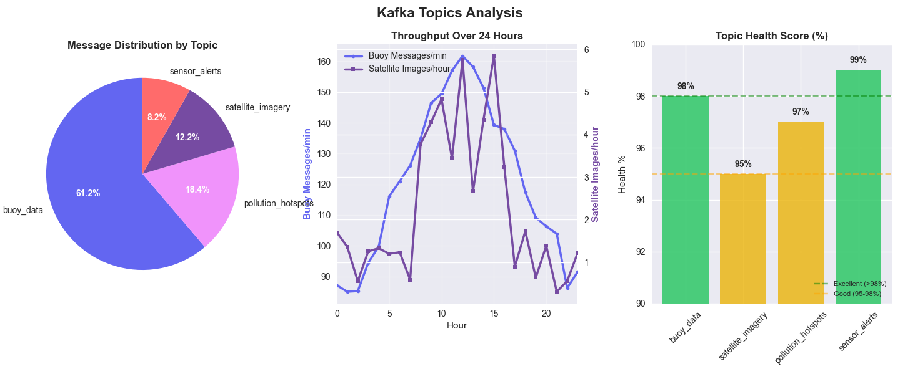

# Marine Pollution Tracking System


## Table of Contents

- [Introduction](#introduction)
- [System Architecture](#system-architecture)
- [Core Components](#core-components)
- [Data Processing Pipeline](#data-processing-pipeline)
- [Dashboard & Visualization](#dashboard--visualization)
- [Installation & Setup](#installation--setup)
- [Performance & Results](#performance--results)
- [Technical Implementation](#technical-implementation)
- [Limitations & Future Work](#limitations--future-work)
- [Team & Contributors](#team--contributors)
- [References](#references)

## Introduction

The Marine Pollution Tracking System is an advanced real-time environmental intelligence platform designed to transform how we monitor and respond to water pollution events. By integrating data from diverse sources—including IoT sensor buoys and satellite imagery—the system enables comprehensive tracking, analysis, and prediction of pollution in the Chesapeake Bay ecosystem.

### The Environmental Challenge

Current water pollution monitoring approaches face critical limitations that hamper effective environmental protection:

- **Data Silos**: Environmental data from different sources (sensors, satellites, manual sampling) remains disconnected, preventing comprehensive analysis
- **Delayed Response**: Manual analysis creates significant lag time between pollution events and intervention, allowing contamination to spread
- **Limited Predictive Capabilities**: Without integrated data and advanced modeling, agencies cannot anticipate pollution spread patterns
- **Reactive Paradigm**: Traditional monitoring is primarily reactive, detecting pollution only after it becomes severe

Our system addresses these challenges by creating a unified, real-time monitoring infrastructure that enables environmental agencies to identify emerging threats quickly, allocate resources efficiently, and develop targeted intervention strategies before pollution events become severe.

### Project Objectives

The Marine Pollution Tracking System aims to:

1. Integrate disparate data sources into a unified environmental monitoring platform
2. Enable real-time detection of pollution events as they emerge
3. Provide predictive capabilities to forecast contamination spread
4. Support data-driven decision-making for environmental protection agencies
5. Transform environmental monitoring from reactive to proactive

## System Architecture

The system implements a modern microservices architecture optimized for real-time environmental data processing. The architecture consists of several integrated layers, each handling specific aspects of the pollution monitoring workflow:


### Architectural Overview

The system follows a distributed microservices pattern with event-driven communication, organized into five primary layers:

1. **Data Acquisition Layer**: Collects data from sensors and satellites, standardizing inputs before publishing to the message broker
2. **Stream Processing Layer**: Processes events in real-time using Apache Flink, performing analysis and detection
3. **Storage Layer**: Implements a medallion architecture (Bronze/Silver/Gold) across multiple specialized databases
4. **Analytics Layer**: Combines rule-based detection with ML models to identify hotspots and predict spread
5. **Presentation Layer**: Provides dashboards and alerts for environmental monitoring and decision support

### Component Interaction Flow

The detailed component interaction diagram shows how data flows through the system:


The architecture enables several key capabilities:

- **Decoupled Components**: Services can be developed, scaled, and maintained independently
- **Failure Isolation**: Issues in one component don't cascade throughout the system
- **Horizontal Scalability**: Components can scale based on processing demands
- **Progressive Enhancement**: The system can evolve through component upgrades

## Core Components

The system comprises multiple specialized microservices organized by function, as visible in the project structure:

```
marine-pollution-tracking/
├── alert_manager/                # Alert processing and notification service
├── buoy_producer/                # Retrieves and publishes sensor data from buoys
├── common/                       # Shared utilities and libraries
├── create_dlq_topics/            # Sets up Dead Letter Queues for error handling
├── dashboard/                    # Streamlit visualization interface
├── dashboard_consumer/           # Prepares data for dashboard visualization
├── data/                         # Data storage directory
├── dlq_consumer/                 # Processes messages from Dead Letter Queues
├── docker-compose.yml            # Container orchestration configuration
├── image_standardizer/           # Processes and standardizes satellite imagery
├── LICENSE                       # License information
├── ml_prediction/                # Machine learning models for pollution prediction
├── pollution_detector/           # Identifies pollution hotspots through analysis
├── README.md                     # Project documentation
├── satellite_producer/           # Retrieves and publishes satellite imagery
├── schemas/                      # Data schema definitions
├── scripts/                      # Utility scripts for setup and maintenance
├── sensor_analyzer/              # Analyzes and classifies sensor readings
├── setup_database/               # Database initialization and configuration
├── setup_minio/                  # MinIO object storage configuration
└── storage_consumer/             # Manages data persistence across storage systems
```

### Data Producers

- **buoy_producer**: Fetches sensor data from NOAA/USGS APIs, validates readings, and publishes to Kafka
- **satellite_producer**: Retrieves Sentinel-2 satellite imagery, preprocesses it, and pushes to Kafka

### Stream Processors

- **image_standardizer**: Normalizes satellite imagery through spectral analysis and format standardization
- **sensor_analyzer**: Performs quality checks, statistical analysis, and anomaly detection on sensor readings
- **pollution_detector**: Uses spatial clustering algorithms to identify potential pollution hotspots
- **ml_prediction**: Executes fluid dynamics models to predict pollution spread patterns

### Data Consumers

- **storage_consumer**: Manages persistent storage across the medallion architecture
- **dashboard_consumer**: Prepares and caches data for visualization components
- **alert_manager**: Processes pollution events and generates notifications
- **dlq_consumer**: Handles messages that failed processing in their primary pipelines

### Storage Services

- **setup_database**: Initializes PostgreSQL with PostGIS extension and TimescaleDB for time-series data
- **setup_minio**: Configures MinIO object storage with appropriate buckets for the medallion architecture

### Support Components

- **common**: Shared utilities, configurations, and libraries used across services
- **schemas**: Data schema definitions ensuring consistent data formats throughout the system
- **scripts**: Utility scripts for setup, maintenance, and testing
- **create_dlq_topics**: Sets up Dead Letter Queues for robust error handling

## Data Processing Pipeline

The system implements a sophisticated data pipeline that processes environmental information through multiple stages, ensuring reliability, accuracy, and analytical depth.

### Data Acquisition

The system ingests data from two primary sources:

1. **Sensor Buoys**: Environmental sensors deployed throughout Chesapeake Bay transmit readings every 30 seconds, providing measurements of:
   - Water quality parameters (pH, dissolved oxygen, turbidity)
   - Chemical contaminants (nitrogen compounds, phosphates, hydrocarbons)
   - Physical properties (temperature, salinity, conductivity)

2. **Satellite Imagery**: Sentinel-2 satellites capture multispectral imagery every 15 minutes, offering:
   - Broad spatial coverage of the entire bay area
   - Spectral bands optimized for water quality assessment
   - Visual confirmation of potential pollution events

### Real-Time Processing

Data flows through a series of specialized Flink jobs that perform increasingly sophisticated analysis:

1. **Data Standardization**: Raw inputs undergo validation, normalization, and format standardization
2. **Anomaly Detection**: Statistical methods identify unusual readings that may indicate pollution
3. **Spatial Analysis**: Clustering algorithms detect potential pollution hotspots
4. **Temporal Analysis**: Time-window processing differentiates new events from evolving existing ones
5. **Predictive Modeling**: Fluid dynamics models simulate contamination spread

### Medallion Architecture

The system implements a comprehensive medallion architecture for data management:

- **Bronze Layer**: Raw data preserved exactly as received, providing the foundation for reprocessing
- **Silver Layer**: Validated, cleansed, and standardized data ready for analysis
- **Gold Layer**: Derived insights, analytical results, and aggregated metrics for visualization

This approach ensures data quality while maintaining complete lineage from raw inputs to final insights.

### Event-Driven Communication

The components communicate through a message-driven architecture:

- **Kafka Topics**: Specialized topics for different data domains enable loose coupling
- **Dead Letter Queues**: Failed messages are captured for analysis and potential reprocessing
- **Schema Registry**: Centralized schema management ensures consistent data formats

This design provides buffering during load spikes, enables multiple consumers for the same events, and ensures reliable message delivery.

## Dashboard & Visualization

The system provides a comprehensive visualization interface designed for environmental monitoring and decision support. The dashboard offers specialized views for different aspects of pollution monitoring:

### Home Dashboard

The main dashboard provides an overview of system status and key environmental metrics:


Key features include:
- System metrics showing active hotspots, alerts, and sensors
- Water quality indicators (pH, turbidity, temperature, microplastics)
- Pollution hotspot map with current detections
- Critical alerts requiring immediate attention
- Pollutant distribution visualization

### Alerts Management

The alerts interface enables monitoring and management of pollution notifications:


This view provides:
- Severity-based alert filtering (high, medium, low)
- Geospatial visualization of alert locations
- Detailed alert information including ID, type, and status
- Key recommendations for intervention
- Statistical analysis of alerts by pollutant type and severity

### Alert Details

Clicking on an alert provides comprehensive information and response guidance:


The detailed view includes:
- Complete alert metadata and status information
- Precise geolocation of the pollution event
- Intervention recommendations with specific actions
- Resource requirements for response operations
- Stakeholder notification recommendations
- Regulatory implications and compliance requirements
- Environmental impact assessment

### Pollution Mapping

The map view provides specialized geospatial visualization of pollution events:


Features include:
- Filterable map display by pollutant type and severity
- Interactive controls for visualization customization
- Detailed statistics on visible hotspots and sensors
- Severity distribution visualization
- Base map selection options

### Hotspot Analysis

The hotspots view enables detailed analysis of pollution concentration areas:


This specialized view offers:
- Hotspot network status overview
- Distribution analysis by pollutant type
- Severity classification visualization
- Risk score calculation by pollutant type
- Advanced analytical tools for pollution pattern identification

### Prediction Forecasting

The predictions interface visualizes the projected spread of pollution events:


This forward-looking view provides:
- Time horizon selection for prediction visualization
- Geospatial representation of predicted pollution spread
- Temporal evolution graph showing contamination progression
- Detailed prediction metrics including confidence scores
- Filtering by severity and prediction timeframe

### Analytical Reporting

The reports view offers in-depth analysis of pollution trends and patterns:


Advanced analytical features include:
- Pollutant trend analysis across time periods
- Comparative visualization by pollutant type
- Severity distribution analysis
- Risk score distribution visualization
- Customizable report generation capabilities

### Sensor Monitoring

The sensor details view provides comprehensive monitoring of individual sensors:


This technical view includes:
- Current sensor readings and status
- Historical measurement visualization
- Parameter correlation analysis
- Trend identification and anomaly highlighting
- Multiple parameter visualization options

## Installation & Setup

### Prerequisites

- Docker and Docker Compose
- 8GB RAM minimum (16GB recommended)
- 50GB free disk space
- Internet connection for data retrieval from NOAA/USGS and SentinelHub

### Installation Steps

1. Clone the repository:
   ```bash
   git clone https://github.com/andrea00mauro00/marine-pollution-tracking.git
   cd marine-pollution-tracking
   ```

2. Configure SentinelHub credentials:
   - Create a credentials.json file in the satellite_producer directory
   - Add your SentinelHub API credentials:
     ```json
     {
       "client_id": "your-client-id",
       "client_secret": "your-client-secret"
     }
     ```

3. Start the system:
   ```bash
   docker-compose up -d
   ```

4. Verify services are running:
   ```bash
   docker-compose ps
   ```

5. Access interfaces:
   - Dashboard: http://localhost:8501
   - MinIO Console: http://localhost:9001 (user/pass: minioadmin)
   - Kafka UI: http://localhost:8080
   - PostgreSQL: localhost:5432 (user: postgres, pass: postgres)

### Docker Infrastructure

The system uses the following Docker images for deployment:
- python:3.9
- postgres:14-alpine
- timescale/timescaledb:latest-pg14
- redis:7-alpine
- confluentinc/cp-zookeeper:7.5.0
- confluentinc/cp-kafka:7.5.0
- minio/minio:latest
- flink:1.17-scala_2.12

## Performance & Results

The Marine Pollution Tracking System demonstrates robust performance characteristics essential for reliable environmental monitoring. Comprehensive testing has validated the system's efficiency, reliability, and scalability.

### System Resource Utilization

The system maintains efficient resource usage while handling complex processing tasks:


Key metrics include:
- **Average CPU utilization**: ~1.2 cores during normal operation
- **Peak processing**: 5 cores during satellite image analysis and pollution detection
- **Memory utilization**: Satellite processing consumes 50% of memory resources
- **Resource efficiency**: System automatically scales down during idle periods

The CPU usage pattern demonstrates characteristic processing behavior:
- Short-duration processing spikes during intensive computation
- Rapid return to baseline during idle periods
- Healthy distribution between system and application processes

### Processing Metrics

The system handles substantial data volume with consistent throughput:


Pipeline metrics show:
- **Data Pipeline Throughput**: 
  - Ingestion: 120 msgs/min
  - Processing: 100 msgs/min
  - Storage: 95 msgs/min
  - Analysis: 80 msgs/min
- **Message Distribution**:
  - Buoy data: 61.2% of message traffic
  - Pollution hotspots: 18.4%
  - Satellite imagery: 12.2%
  - Sensor alerts: 8.2%

Resource allocation is strategically distributed with processing components (40%), storage (30%), monitoring (20%), and producers (10%), optimizing the system for computational efficiency.

### Reliability Metrics

The system demonstrates exceptional reliability characteristics:



Key reliability indicators include:
- **Topic Health Scores**: >95% across all Kafka topics
- **Error Handling**: Low DLQ message counts (1-5 errors) demonstrate >95% success rate
- **System Stability**: No sustained high-load periods, indicating good resource management
- **Processing Consistency**: Balanced throughput across 24-hour operation periods

The implementation of Dead Letter Queues provides robust fault tolerance, with comprehensive error handling ensuring no data loss during processing failures.

### Operational Validation

The performance metrics validate the system's capability to handle real-time marine pollution monitoring with:
- Efficient resource management optimized for environmental processing tasks
- Robust error handling with comprehensive fault tolerance
- Processing power scaled appropriately for complex analytical operations
- Reliable data transmission across distributed components

## Technical Implementation

### Technology Stack & Justifications

The system employs a carefully selected technology stack, with each component chosen for specific technical advantages:

| Component | Technology | Justification |
|-----------|------------|---------------|
| Core Language | Python | Rich data science ecosystem (NumPy, pandas) with native Flink/Kafka integration via PyFlink. Simplified satellite image processing with rasterio and effective ML model integration. |
| Containerization platform | Docker | Ensures consistent deployment across environments for all 11 microservices. Docker Compose orchestrates the system with appropriate resource allocation and network isolation. |
| In-Memory Cache | Redis | Microsecond access to frequent queries, optimized for geospatial operations with sorted sets. Supports real-time dashboard updates and alert distribution with pub/sub capabilities. |
| Message Broker | Kafka | Fault-tolerant data pipeline with topic partitioning for high-throughput sensor data. Persistence ensures reliable delivery of critical environmental measurements and supports event replay for analysis. |
| Stream Processing | Apache Flink | True event-time processing with exactly-once semantics critical for temporal pollution analysis. Stateful computations enable tracking pollution evolution with sub-100ms latency. |
| Main Database | PostgreSQL | ACID-compliant storage for pollution events and metadata. PostGIS extension enables critical geospatial queries for hotspot identification and intervention planning. |
| Time-Series | TimescaleDB | PostgreSQL extension optimized for sensor time-series data, with hypertables providing efficient querying of historical measurements. Supports continuous aggregations for trend analysis. |
| Object Storage | MinIO | Implements bronze/silver/gold medallion architecture for data quality management. S3-compatible API with versioning supports large satellite imagery storage and processing pipeline integration. |
| Dashboard | Streamlit | Rapid development of interactive pollution maps and monitoring dashboards. Integrates with geospatial libraries to provide actionable environmental intelligence to stakeholders. |
| Error Handling | DLQ Pattern | Implements Dead Letter Queues for each Kafka topic to ensure no data loss during processing failures. Provides robust fault tolerance with >95% reliability for mission-critical environmental monitoring. |

### Machine Learning Implementation

The system incorporates four specialized predictive models:

1. **Contamination Spread Model**: Uses fluid dynamics principles to predict how pollution will disperse through water based on currents, wind patterns, and pollutant properties

2. **Source Identification Algorithm**: Employs backtracking techniques to identify potential pollution sources based on detected patterns and environmental conditions

3. **Severity Classification System**: Categorizes pollution events by environmental impact severity using multi-parameter analysis and historical comparison

4. **Temporal Evolution Predictor**: Forecasts how contamination profiles will change over time, enabling proactive intervention planning

These models incorporate multiple environmental factors:
- Fluid dynamics principles for water movement modeling
- Pollutant physical properties (density, solubility, degradation rates)
- Environmental patterns (seasonal winds, water currents, temperature gradients)
- Historical pollution behavior patterns from similar events

### Containerization & Orchestration

The system leverages Docker and Docker Compose for consistent deployment and operation:

- **Service Isolation**: Each component runs in its own container with appropriate resource limits
- **Network Configuration**: Internal communication occurs over defined networks with appropriate security
- **Volume Management**: Persistent data is stored in named volumes for data preservation
- **Health Monitoring**: All services include health checks for operational monitoring
- **Resource Allocation**: Containers are configured with appropriate CPU and memory limits
- **Restart Policies**: Automatic recovery from failures ensures operational continuity

This containerized approach enables consistent deployment across development, testing, and production environments while simplifying scaling and maintenance.

## Limitations & Future Work

### Current Limitations

Despite its advanced capabilities, the current implementation has several limitations:

1. **Synthetic Data Reliance**: The system currently uses synthetic data rather than real NOAA/USGS APIs and Sentinel Hub services, limiting validation under authentic environmental conditions

2. **Static ML Models**: Basic RandomForest classifiers built on synthetic data without mechanisms for retraining with newly collected information

3. **Spatial Clustering Constraints**: The hybrid approach with fixed grid size struggles with events crossing grid boundaries and isn't optimal across varying data densities

4. **Data Governance Limitations**: The MinIO implementation lacks comprehensive governance features such as quality monitoring, lineage tracking, and automated schema evolution

5. **Limited Analytics**: Dashboard offers basic analytical capabilities compared to enterprise platforms

6. **External Integration**: Lacks integration with external alerting infrastructure necessary for operational deployment in environmental agencies

### Scaling Challenges

As the system scales to handle larger geographic areas or higher data volumes, several components would require enhancement:

- **Memory Management**: Flink jobs would encounter memory constraints during satellite imagery analysis and pollution detection

- **Spatial Clustering**: The current approach would face computational bottlenecks in high-density regions

- **Message Broker**: The single-node Kafka configuration would experience performance degradation with increased volume

- **Time-Series Storage**: TimescaleDB would face challenges as data accumulates without proper hypertable partitioning strategies

### Potential Improvements

Several improvements could address current limitations without a complete redesign:

- **Continuous Learning**: Implement mechanisms for ML models to update with newly collected data

- **Adaptive Spatial Clustering**: Implement adaptive grid sizing based on data density with boundary-crossing detection

- **State Management**: Develop improved strategies for Flink jobs including backpressure handling and optimized checkpointing

- **Data Lifecycle Management**: Implement automated archiving for historical data while maintaining access to recent measurements

- **Enhanced Analytics**: Strengthen the dashboard with more advanced analytical capabilities

### Future Work

With additional resources, future development would prioritize:

- **Real Data Integration**: Connect with NOAA, USGS, and Copernicus APIs for authentic environmental readings

- **Comprehensive ML Pipeline**: Develop continuous training, performance monitoring, and drift detection capabilities

- **Advanced Spatial Framework**: Implement multi-level gridding, adaptive partitioning, and specialized algorithms for different pollution patterns

- **Cross-Validation Mechanisms**: Create validation between different data sources to increase confidence in event detection

- **Infrastructure Optimization**: Implement proper Kafka clustering, optimize TimescaleDB, and deploy comprehensive monitoring

- **Kubernetes Deployment**: Develop dynamic scaling capabilities based on data volume and processing requirements

## Team & Contributors

This project was developed by:

- [@lorenzoattolico](https://github.com/lorenzoattolico)  
- [@andrea00mauro00](https://github.com/andrea00mauro00)  
- [@marcoRossi27](https://github.com/marcoRossi27)  
- [@walterscf](https://github.com/walterscf)

## References

This project leverages foundational research in environmental monitoring, anomaly detection, and satellite image analysis:

[1] Sannigrahi, S., Basu, B., Basu, A. S., & Pilla, F. (2021). *Detection of marine floating plastic using Sentinel-2 imagery and machine learning models*. arXiv preprint arXiv:2106.03694.

[2] Walsh, E. S., Kreakie, B. J., Cantwell, M. G., & Nacci, D. (2017). *A Random Forest approach to predict the spatial distribution of sediment pollution in an estuarine system*. PLoS One, 12(7), e0179473.

[3] Li, Z., Zhu, Y., & Van Leeuwen, M. (2023). *A survey on explainable anomaly detection*. ACM Transactions on Knowledge Discovery from Data, 18(1), 1–54.

[4] El-Shafeiy, E., Alsabaan, M., Ibrahem, M. I., & Elwahsh, H. (2023). *Real-time anomaly detection for water quality sensor monitoring based on multivariate deep learning technique*. Sensors, 23(20), 8613.

[5] Zhou, H., Zhang, S., Peng, J., Zhang, S., Li, J., Xiong, H., & Zhang, W. (2021). *Informer: Beyond efficient transformer for long sequence time-series forecasting*. Proceedings of the AAAI Conference on Artificial Intelligence, 35(12), 11106–11115.

[6] Yao, J., Zhang, B., Li, C., Hong, D., & Chanussot, J. (2023). *Extended Vision Transformer (ExViT) for Land Use and Land Cover Classification: A Multimodal Deep Learning Framework*. IEEE Transactions on Geoscience and Remote Sensing, 61, 1–15. https://doi.org/10.1109/TGRS.2023.3284671

[7] Sadaiappan, B., Balakrishnan, P., CR, V., Vijayan, N. T., Subramanian, M., & Gauns, M. U. (2023). *Applications of machine learning in chemical and biological oceanography*. ACS Omega, 8(18), 15831–15853.


